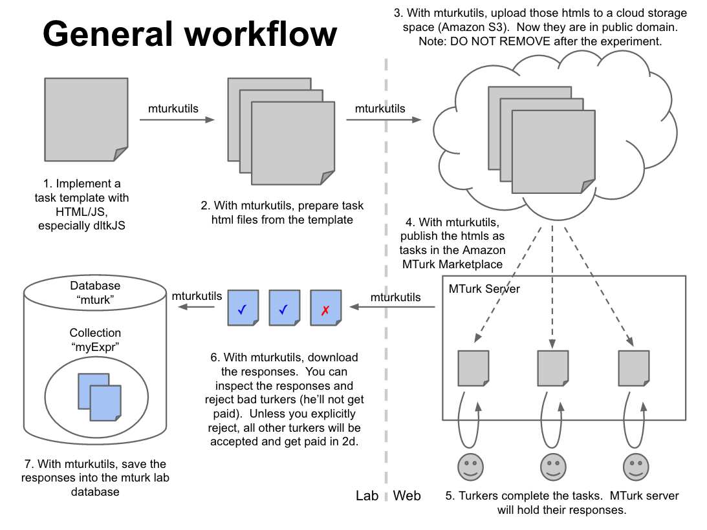

# Getting started with MTurk for DiCarlo Lab

We use Amazon Mechanical Turk (MTurk) for high-throughput web-based human psychophysics.

## Setup

1. **Training for human subjects:** Before you begin launching any task, make sure you have contacted the lab manager and have taken the appropriate [Collaborative Institutional Training Initiative](http://couhes.mit.edu/training-research-involving-human-subjects) (CITI) courses. 

2. **Amazon Credentials:** You will also need credentials separately for Amazon S3 and MTurk. Someone from the lab will help you get those credentials. Once you get them go to the home folder of [mh17](http://mindhive.mit.edu/intro) (simply `ssh username@mh17.mit.edu`) and create a file named '.boto' The contents of the file should look like:

    [Credentials]
    aws_access_key_id=AKEYOUWILLGET
    aws_secret_access_key=thesecretkeyuwillget
    [MTurkCredentials]
    AWS_ACCESS_KEY_ID = AKEYOUWILLGET
    AWS_SECRET_ACCESS_KEY = thesecretkeyuwillget

3. **Access to MTurk account:** The other _username_ and _password_ you will need is for the Amazon Mechanical Turk Requester account. This is where you can check how many **HITs** (_Human Intelligence Tasks_) you have launched and how many subjects have responded so far etc. You can also directly download the results and work off it, but it is suggested that you use the existing lab tools (i.e., mturkutils) to organize the process and make it more efficient and the data easily shareable.

4. **MTurk mailing list:** Ask somebody in the lab to get added to the lab's MTurk mailing list, so that you can receive workers' emails in case something is up.

## General workflow



Ha (hahong@mit.edu) has provided a tutorial that deals with each of the steps. Click the tutorial link below to see it. ([Tutorial](https://github.com/dicarlolab/mturkutils/blob/master/tutorials/Hands-on%20tutorial.pdf))

Briefly, here are the steps to get your experiment going on MTurk:

### Where things are

- HTMLs for each HIT are stored on the lab's [S3 space](https://aws.amazon.com/)
- HITs meant for testing or for in-lab participants are managed via [MTurk Developer Sandbox](https://workersandbox.mturk.com)
- HITs meant for data collection are managed via [MTurk](https://www.mturk.com)
- Data is stored in a MongoDB on DiCarlo5 (`dicarlo5.mit.edu`), and you have to put it there yourself. MTurk does not store the collected data forever, so you should always update the database with your data after the experiment is over.

### Getting started

1. Copy an existing experiment from "experiments" folder. `hvm_2_way` or `objectome_64objs_v2` might be a good way to start.
2. Template html file (usually inside the `web` subfolder) defines how each HIT looks like.
3. The `driver.py` file specifies how to generate html files that will be uploaded to S3 for each HIT from the template.
4. Running `python driver.py` will generate HITs in a sandbox. You should always test them to make sure they work before making production HITs. HIT IDs will be printed and also saved in a pickle file for later use when you want to download data.
5. Running `python driver.py production` will generate the actual HITs that MTurkers can complete.

### Create HITs

```python
exp = get_exp()[0]
exp.prepHTMLs()
exp.testHTMLs()
exp.uploadHTMLs()
exp.createHIT(secure=True)
```

### Test HITs

You should *always* test your sandbox HITs before putting them in production.

1. Create HITs in the sandbox.
2. Login as a worker using the lab's Amazon credentials.
3. Look up your collection of HITs.
4. Start a HIT. Make sure you accept it so that data can be submitted at the end of it.
5. Complete the HIT. If you don't feel like clicking your way through, there are simple apps for that, e.g. [Fast Clicker](http://www.murgaa.com/fast-clicker/)
6. Now login as a requester and see if the data is there or use mturkutils to download your data.

### Store data in dicarlo5

```python
import cPickle
from driver_basic import get_exp 
exp = get_exp(sandbox=False)[0]
hitids = cPickle.load(open(‘PICKLEFILE.pkl’))
exp.updateDBwithHITs(hitids)
```

### Retrieve data stored in dicarlo5

```python
import pymongo

mongo_conn = pymongo.Connection(host='localhost', port=22334)
db = mongo_conn['mturk']
coll = db['your_collection_name']

# To look inside a collection
for doc in coll.find():
  data = doc['ImgData’]
  ...
```
In case you need to establish an ssh tunnel into dicarlo5:

`ssh -f -N -L 22334:localhost:22334 <username>@dicarlo5.mit.edu`
